# Let's Make a Map: Part I!
## By: Joey Lee
### Prepared: Nov. 2014 for the TerreWEB Mapping Workshop @ UBC, Vancouver
***
## Overview:
I've always liked seeing projects and understanding how the artist/designer put them together. It was helpful for me to visualize what each step of the process was doing to contribute to the final product. So today, here is an image of what you will be able to walk away with by following this tutorial (There's a part II if you're hungry for more after this!):
	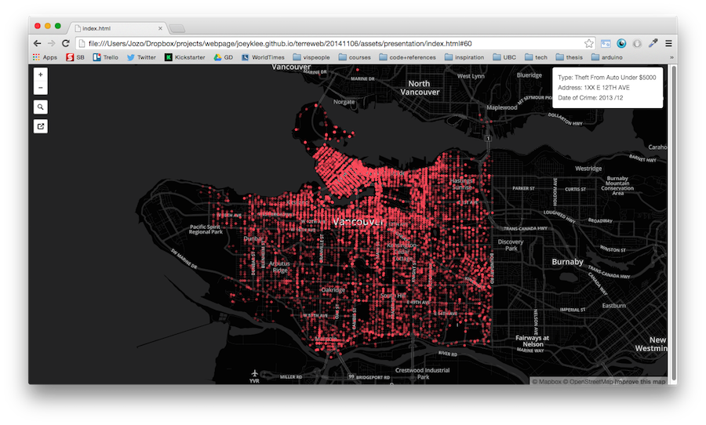

Here we have **an interactive web map** that is comprised of a **baselayer** which we style in **Mapbox** and an interactive **feature layer** which shows the **crime** data from 2013 in Vancouver that we style and export from **Tilemill**. Its a fully functioning web map that shows data on your mouse **hover** and can be **embedded** in your **blog** or **webpage**.  

## Getting Started:
1. ### Fire up Tilemill!
	The Tilemill interface looks like this. If you fall in love with geomapping, you might spend a lot of time here :)
	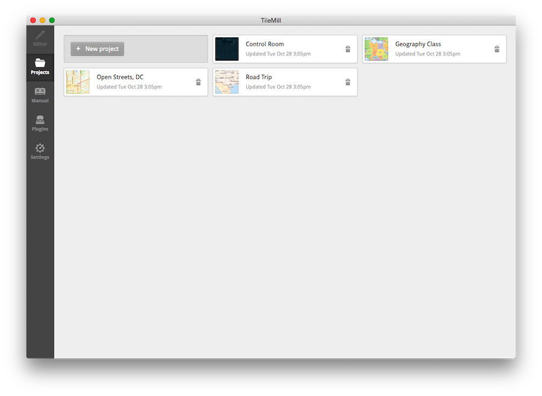

2. ### Start a new project
	Click 'New project' and you will get pop-up window as shown below. Add in the name and description (optional) and  click 'Add'. I typically use the 8-bit png (256 colors), but you may choose to use a higher res png (full color) or jpeg tiles.
	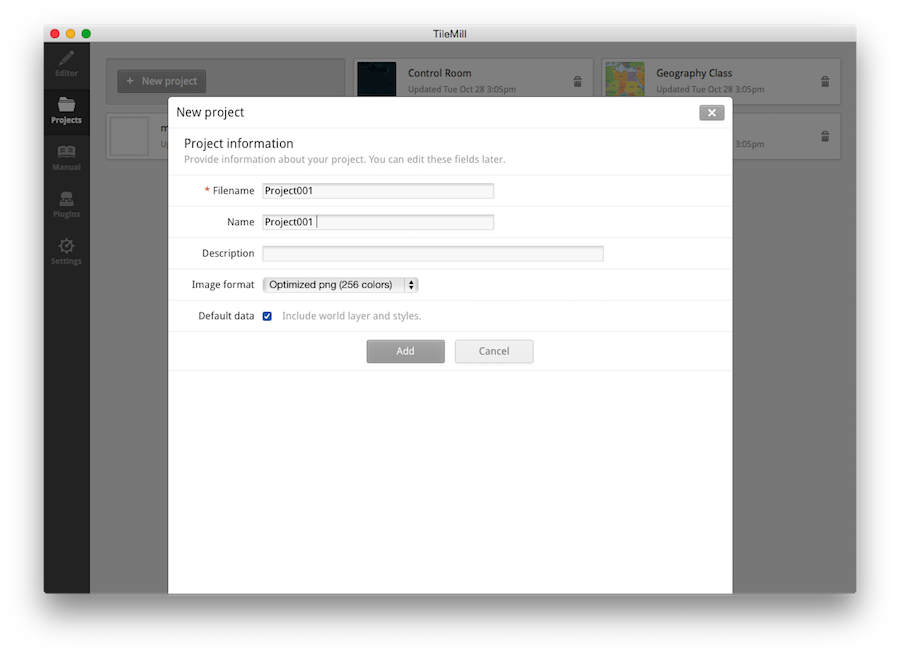

3. ### Enter Tilemill & Add Layer
	Add a layer by clicking on the layers  button.
	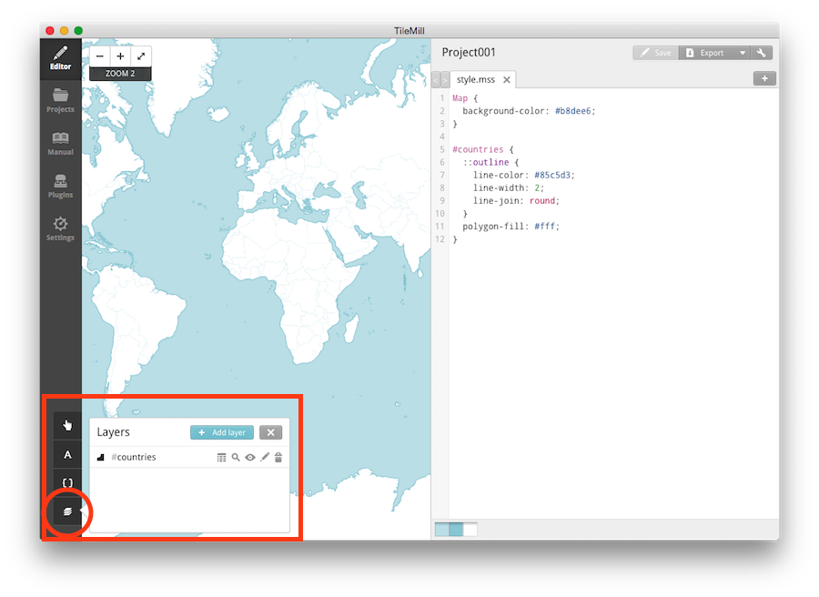

	Add in a name for the layer.
	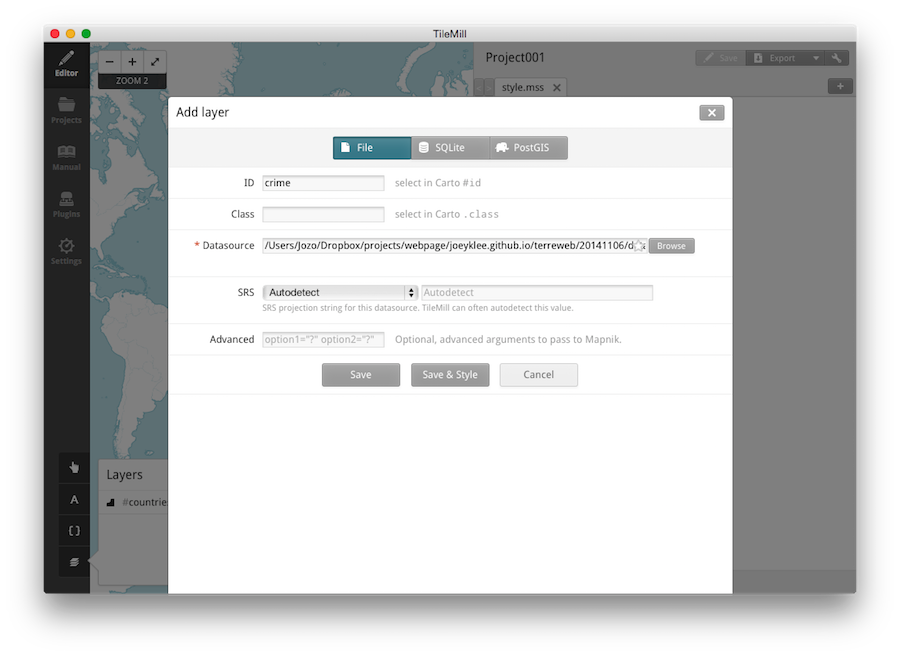
	
	Navigate to the file you want to add. In this case the "crime2013.geojson" located in: "data/crime2013/geo/" 
	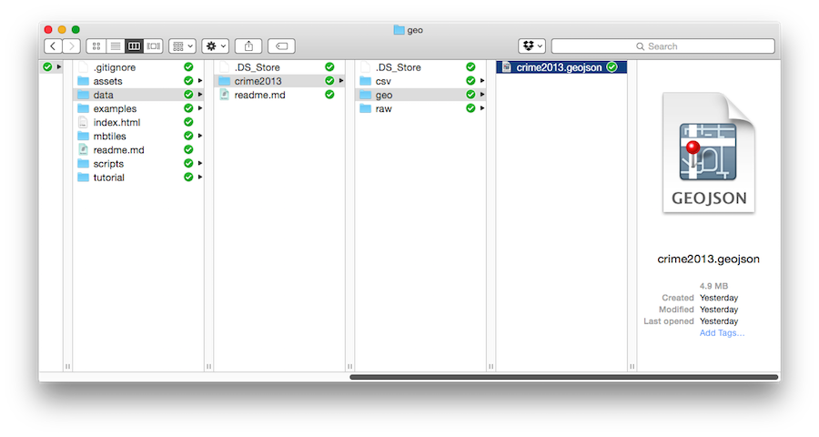
	
4. ### Adjust the Bounding Box & Zoom Levels
	Adjust the ***bounding box*** by dragging the sides of the box to the size around your area of interest. In this case, it is beautiful Vancouver.
	
	Adjust the ***zoom levels*** by dragging both ends of the range slider. We will set out zoom levels from 11 to 15.
	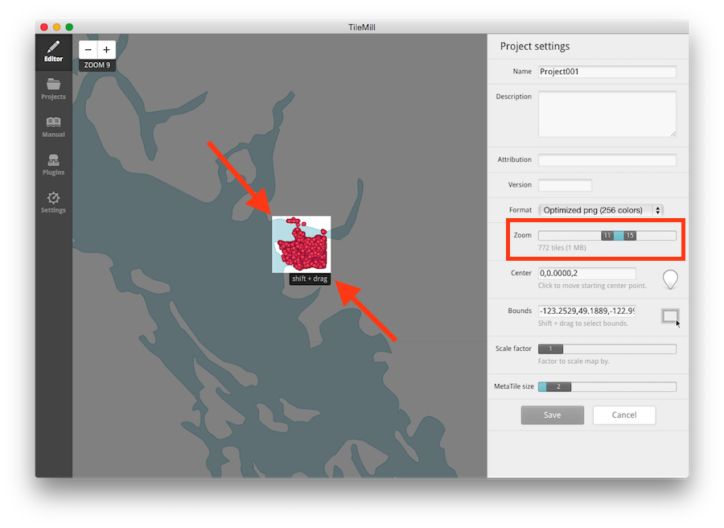
	
	***Note: The number of tiles (and thus the file size) increases exponentially, so the more zoom levels you include, the exponentially larger file size you will generate.***
	
5. ### Adjust the Marker Style
	Notice several things here:
	
	The ***double slashes*** '//' indicate a comment - anything following a '//' will not be interpreted by tilemill, thus allowing us to make notes to ourselved in our code.
	
	***Colors*** can be adjusted using [hex color codes](http://www.w3schools.com/tags/ref_colorpicker.asp) 
	
	***opacity*** can be adjusted on a 0 to 1 scale, 0 is completely transparent, 1 is completely visible. You can also use %'s from 0% to 100%
	
	***marker-comp-op*** is a property with many magical modes for feature & color blending, among other things. Definitely worth reading the documentation. 
	
        #crime {
           marker-width:5; // changed marker size
           marker-fill:#f45;
           marker-line-color:#813;
           marker-allow-overlap:true;
           marker-ignore-placement:false;
           // added styles
           marker-opacity:0.35;
           marker-line-opacity:0;
           marker-comp-op:lighten;
        } 

	You will see this on the screen. Don't worry, we'll be able to see our styled crime data in a second.
	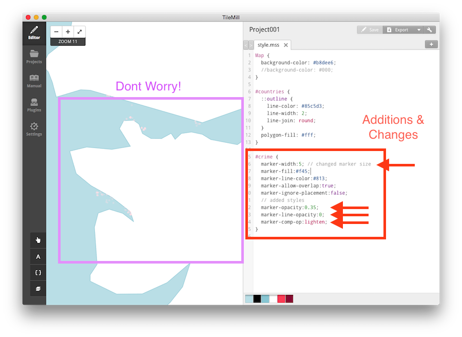

6. ### Comment out the '#countries' and 'Map' Styles
	Since we want to use the crime layer as an **overlay** feature layer, let's comment out the '#countries' and 'Map' layers so we can see our styled crime layer.
	
	We are using another style of CSS commenting syntax here to comment out a large code block. Everything between the set of /* ... */ will not be interpreted by Tilemill.
	   
	    /* 
	    a bunch of css code
	    more code
	    and another line 
	    */
	
	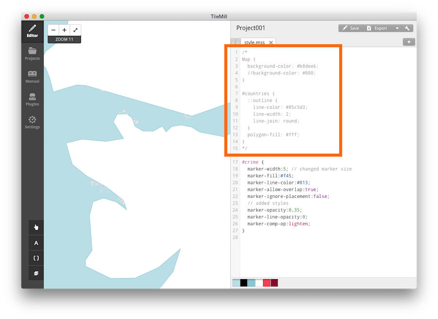
	
	You should now see something like this:
	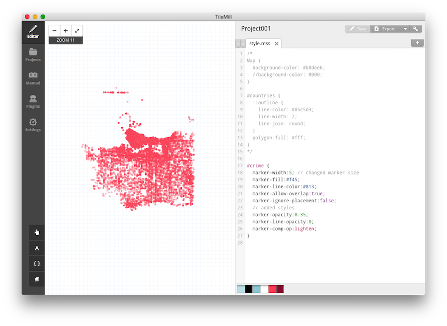

7. ### Adding Tooltips
	Step 1: Navigate to the ***Tooltips options*** indicated by the pointer icon 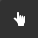. 
	
	Step 2: At the top of the screen you will see a box labeled ***"Teaser"***. We will edit the contents of the Teaser so that selected data from your geodata will appear on mouse hover.
	
	Step 3: Notice there is a dropdown menu, currently set to 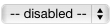. Click the dropdown and select ***crime***
	
	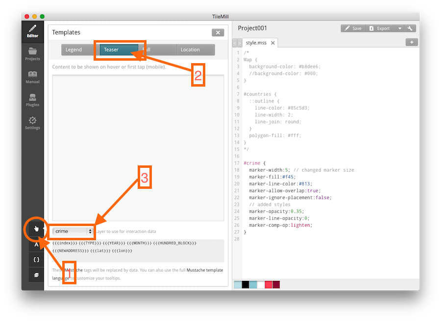
	
	***Notice***: there should now be the names of the keys (columns) from the crime2013.geojson file sandwiched between a set of ***mustache tags*** {{{ key }}}. 
	
        {{{index}}} {{{TYPE}}} {{{YEAR}}} {{{MONTH}}} {{{HUNDRED_BLOCK}}} {{{NEWADDRESS}}} {{{lat}}} {{{lon}}}

	 The Mustache tags '{{{ }}}' reference the named columns in the data, making them accessible on mouse hover. 
	 
	 Let's show the "type of crime", "year" and "month", and "address" of the crimes. Thus let's use these:
	  
	     {{{TYPE}}} 
	  
	     {{{YEAR}}}
	  
	     {{{MONTH}}}
	  
	     {{{HUNDRED_BLOCK}}}

8. ### Tooltip text formatting
	Now let's add in the content to be shown on mouse hover.
	
	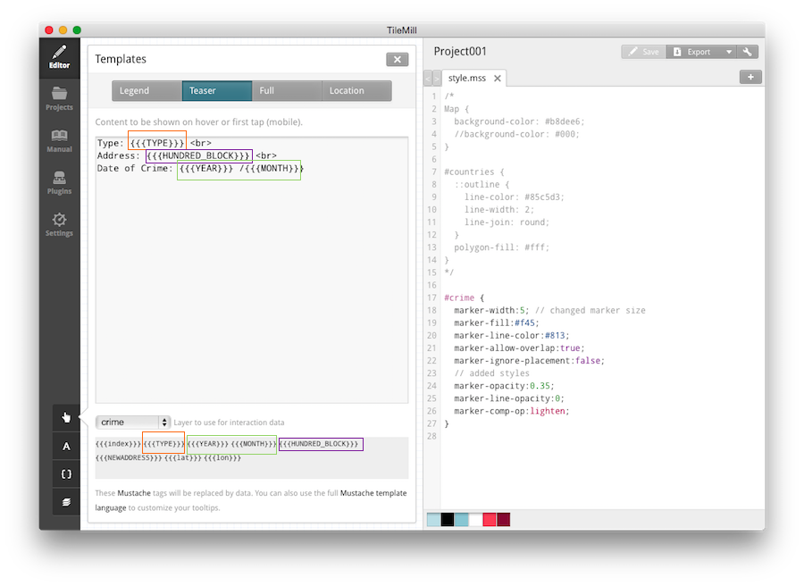
	
	In the content box we can use this structure as a basic template. Below is out input into the content box...
	
	
        Type: {{{TYPE}}}  
        Address: {{{HUNDRED_BLOCK}}}  
        Date of Crime: {{{YEAR}}} /{{{MONTH}}}

	... and here is how it gets translated when hover over a feature on the map.
	
	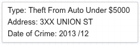

	***Notice***: 
		
	"Type", "Address",and "Date of Crime" are just indicators of what each of the mustache tags are showing.

	The linebreak (< br >) tags are HTML syntax that, well, create a linebreaks so that your text gets split onto different lines. ***This is important*** to note because you can add html syntax into the content box to help format your hover content as you wish.

	You can now click the "X" and check out your map.
	
9. ### Exporting/Uploading to Mapbox
	In the top-right corner, notice the 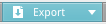 button. Click it and go to "upload".
	
	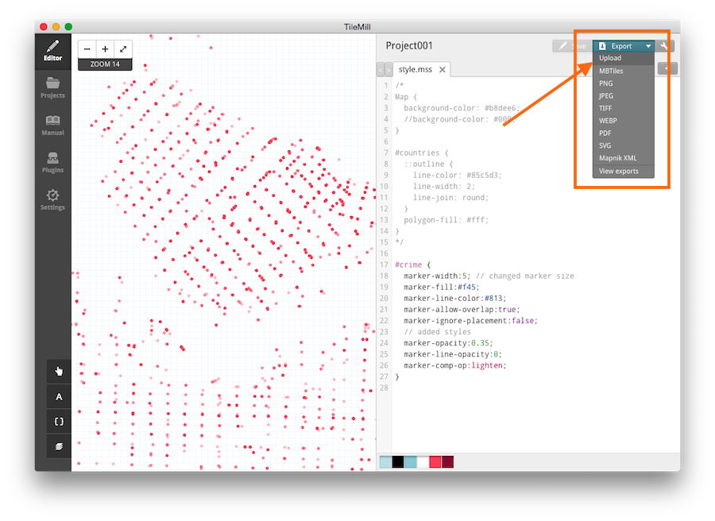
	
	Since we are going to upload directly to Mapbox and host our tiles on their servers, just click "upload". Make sure the name, zoom levels, and bounding box are all to your liking, then jump down to the big "upload button".
	
	

	***Note***: In the future, you might export to .mbtiles and serve your tiles another way, but that's for another time.

10. ### Starting a Mapbox Project

	Sign in to [Mapbox](www.mapbox.com) and navigate to "data".
	
	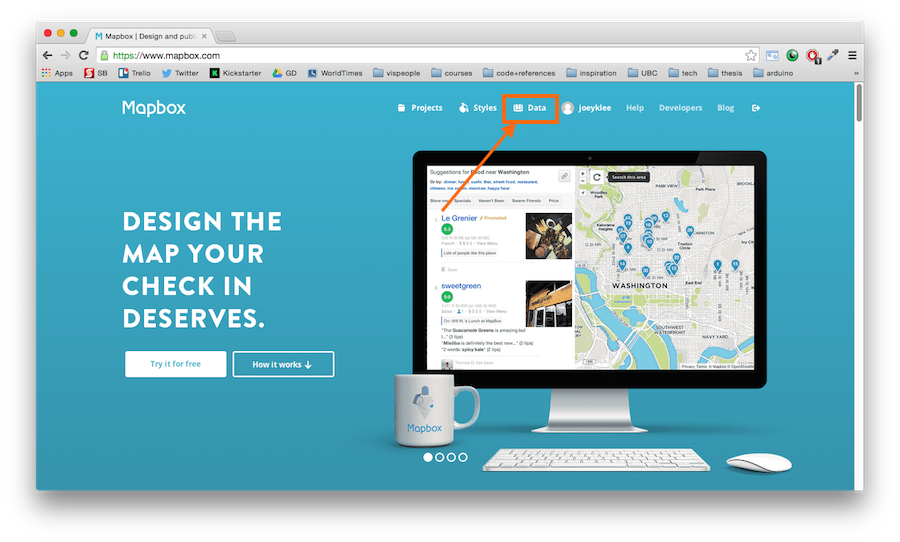
	
	In "data" you will see your crime .mbtiles called "Project001" (your file name might be different). Click it!
	
	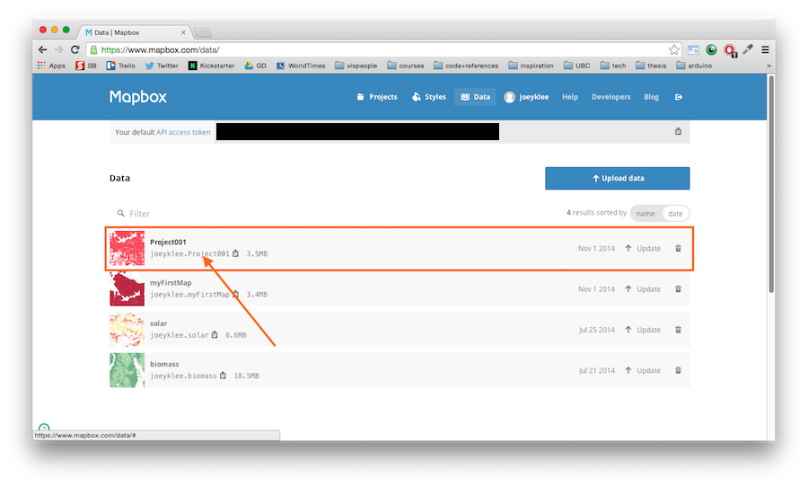

	We're now going to "create project"...
	
	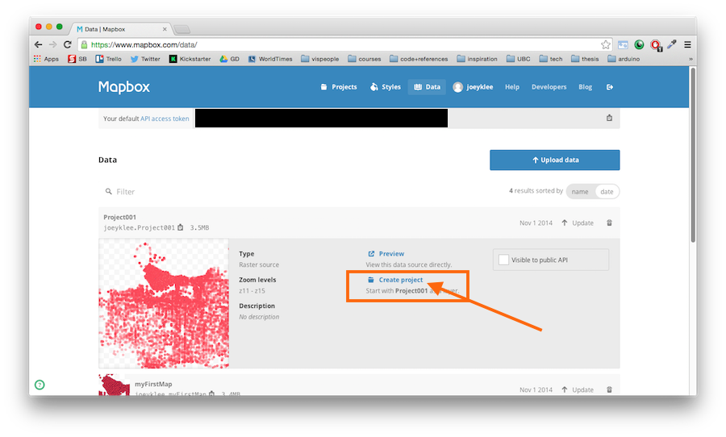

	...and add in some details about our new project.
	            
	    step 1: Click project
	    step 3: Click settings (just next to info)
	    step 2: Enter the project title
	    step 3: Add a meaningful description
	
	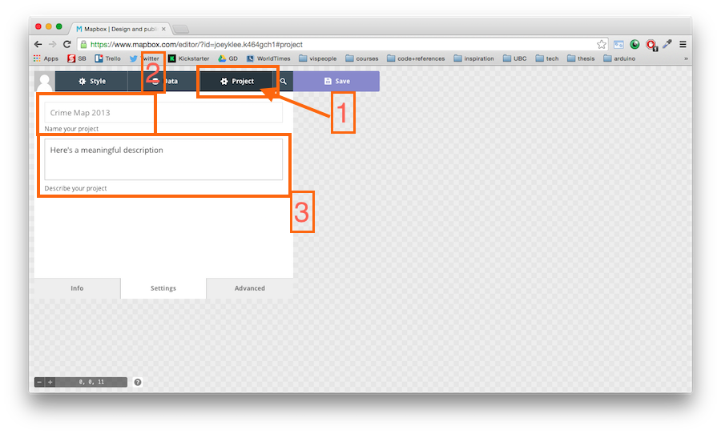
	
	and Click "save".
	
11. ### Styling the Baselayer
	In the top bar, navigate to "style" and "discard palette".
	
	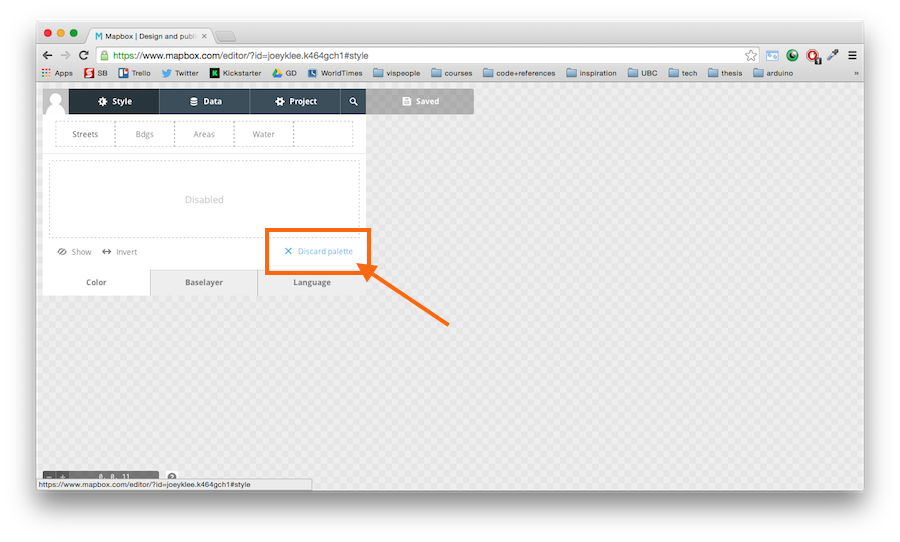
	
	
	If you click "presets", you'll see the mapbox preset style baselayer popup!
	
	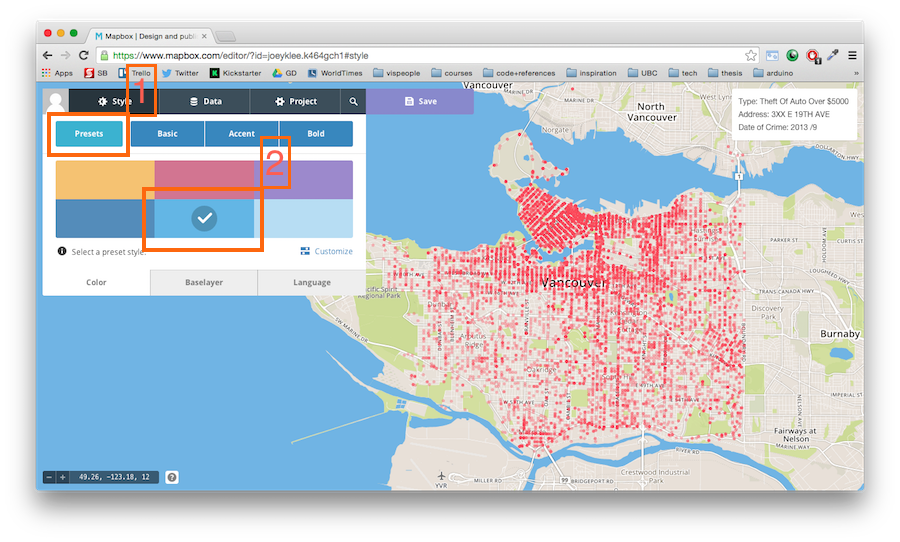
	
	***Note***: You may need to pan/zoom to your area of interest (Vancouver) in order to see your data. The default might be somewhere in the Atlantic Ocean and all you might see if blue.
	
	The default baselayer is cool, but let's customize it to highlight the points better. Here, I will customize the "bold" preset with darker colors.
	
	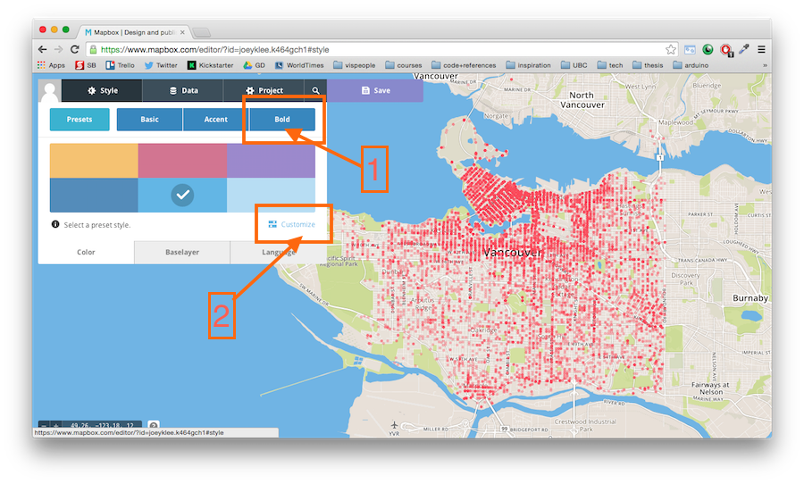
	
	In the interface you can toggle layers and adjust their colors. You'll have to explore further and decide for yourself what tickles your fancy.
	
	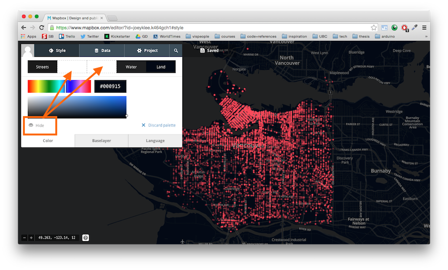
	
	And voila! our first interactive basemap. Now all you have to do is paste the embed code into your blog or webpage and you, friend, have made your first interactive map!
	
	
	

## Note:
In this tutorial, we didn't go over the three points listed below, BUT if you navigate to **Tutorial II**, we can go over these major points and take our map further. 

### Legends
For this exercise, we didn't need a legend, but should you be interested in including one, you can flex your copy/paste and hex color muscles based on this super nice [Mapbox legends tutorial](https://www.mapbox.com/tilemill/docs/crashcourse/tooltips/)

### Styling data based on attribute value
We also show all the crime data in 1 color, but we might gain more insight from the data if we were to style each crime differently. There's a [Mapbox styling data tutorial](https://www.mapbox.com/tilemill/docs/crashcourse/styling/) that can help you understand how to style data properties differently based on their value.

### Styling data according to zoom levels
And you guessed it, there's a [Mapbox tutorial for styling for different zoom levels](https://www.mapbox.com/tilemill/docs/guides/advanced-map-design/). You may notice that since we kept the points are pretty small at zoom level 15. You can changed how they scale to make them more visible. 
	
 
## References:
+ [Lyzi Diamond's nice presentation](http://lyzidiamond.com/leaflet/#1) - covers the basics of maptiles and creating your first leaflet project.
+ [Alan McConchie and Beth Schetcher on the Anatomy of a web map](http://maptime.io/anatomy-of-a-web-map/#0) - A really comprehensive and digestible overview of web maps, what makes them unique, and how they work.
+ [Mapbox tutorial for making your first map](https://www.mapbox.com/tilemill/docs/crashcourse/introduction/) - this is where it all started for me...
+ [Google chart parameters list](https://developers.google.com/chart/image/docs/chart_params) - documentation of the parameters for the google charts.
+ [A really super cool presentation by Eric Thiese on the Geostack](http://erictheise.github.io/geostack-deck/#/) - Definitely check this out.